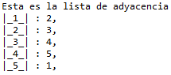
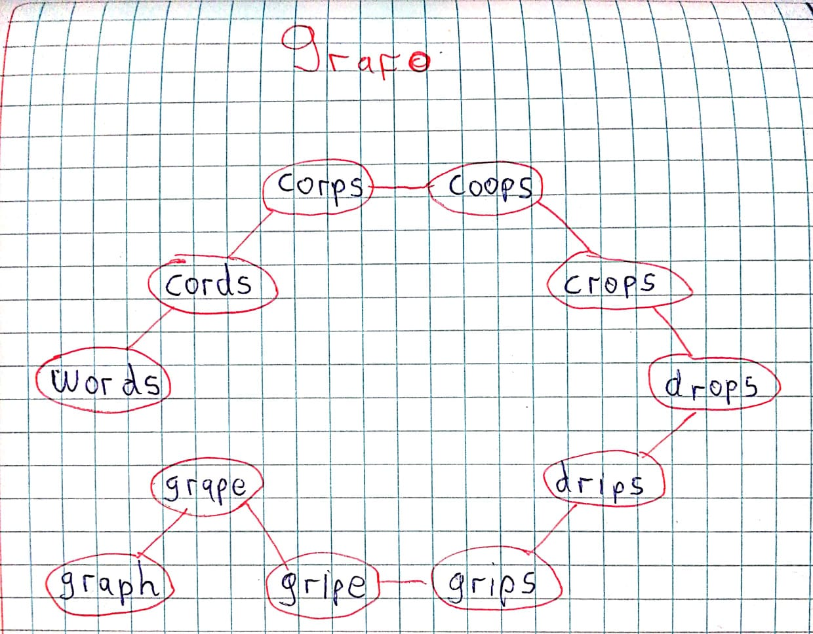
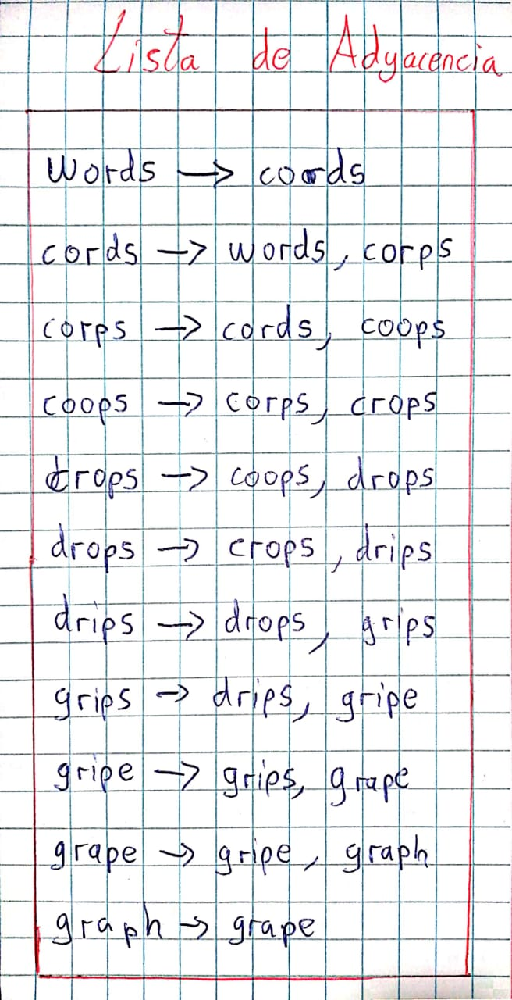
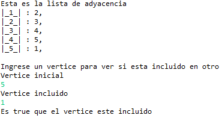

<table>
    <theader>
        <tr>
            <td></td>
            <th>
                UNIVERSIDAD NACIONAL DE SAN AGUSTIN 
                FACULTAD DE INGENIERÍA DE PRODUCCIÓN Y SERVICIOS 
                ESCUELA PROFESIONAL DE INGENIERÍA DE SISTEMAS
            </th>
            <td></td>
        </tr>
    </theader>
    <tbody>
        <tr><td colspan="3">Formato: Guía de Práctica de Laboratorio / Talleres / Centros de Simulación</td></tr>
        <tr><td>Aprobación:  2022/03/01</td><td>Código: GUIA-PRLD-001</td><td>Página: 1</td></tr>
    </tbody>
</table>

    <h2>INFORME DE LABORATORIO</h2>

<table>
<theader>
    <tr><th colspan="6" style="width:50%; height:auto; text-align:center">INFORMACIÓN BÁSICA</th></tr>
</theader>
<tbody>
    <tr>
        <td>ASIGNATURA:</td><td colspan="5">Laboratorio de Estructura de Datos y Algoritmos</td>
    </tr>
    <tr>
        <td>TÍTULO DE LA PRÁCTICA:</td><td colspan="5">Grafos</td>
    </tr>
    <tr>
        <td>NÚMERO DE PRÁCTICA:</td><td>08</td><td>AÑO LECTIVO:</td><td>2022 A</td><td>NRO. SEMESTRE:</td><td>III</td>
    </tr>
    <tr>
        <td colspan="2">FECHA DE PRESENTACIÓN</td><td>21-Ago-2022</td><td colspan="2">HORA DE PRESENTACIÓN: </td><td>11:59 pm</td>
    </tr>
    <tr>
        <td colspan="3">INTEGRANTES:
        <ol>
        <li>Umasi Cariapaza, Carlos Daniel</li>
        </ol>
        </td>
        <td colspan="2"> NOTA:</td>
        <td>     </td>
    </tr>
    <tr>
        <td colspan="6">DOCENTE: 
        Mg. Richart Smith Escobedo Quispe
        </td>
    </tr>
</tdbody>
</table>

<table>
    <theader>
        <tr>
            <th style="text-align:center">SOLUCIÓN Y RESULTADOS</th>
        </tr>
    </theader>
    <tbody>
        <tr>
            <td>
                I. SOLUCIÓN DE EJERCICIOS/PROBLEMAS 
                
1. Crear un repositorio en GitHub, donde incluyan la resolucion de los ejercicios propuestos y el informe. 

                
2. Implementar el cogido de Grafo cuya representacion sea realizada mediante LISTA DE ADYACENCIA. (3 puntos) 

                
Se implementó el código en la carpeta Ejercicio1 en la clase Grafo, además se hizo una clase Test la cual pide en consola que ingrese los vértices que van del 1 al 5 y sus respectivos vértices que queramos que sean adyacentes para así mostrarnos en una LISTA DE ADYACENCIA los resultados del código. 
                Imagen referencial de la prueba hecha en la clase Test: 
                

                
3. Implementar BSF, DFS y Dijkstra con sus respectivos casos de prueba. (5 puntos) 

                
Se implementó el código en la carpeta Ejercicio2 diferentes clases con su respectivo nombre, además de sus respectivas clases Test las cuales  piden por consola que ingrese los vértices que van del 1 al 5 y sus respectivos vértices que queramos que sean adyacentes para así mostrarnos en una las distintas formas de buscar los caminos dependiendo el grafo dándonos  los resultados en consola de las búsquedas.

                
4. Solucionar el siguiente ejercicio: (5 puntos) 
                El grafo de palabras se define de la siguiente manera: cada vértice es una palabra en el idioma Inglés y dos palabras son adyacentes si difieren exactamente en una posición. Por ejemplo, las cords y los corps son adyacentes, mientras que los corps y crops no lo son. 
                a) Dibuje el grafo definido por las siguientes palabras: words cords corps coops crops drops drips grips gripe grape graph 
                b) Mostrar la lista de adyacencia del grafo. 

                
a)Imagen del dibujo de los grafos: 
                 
                b) Imagen de la lista de adyacencia del grafo: 
                 

                
5. Realizar un metodo en la clase Grafo. Este metodo permitira saber si un grafo esta incluido en otro. Los parametros de entrada son 2 grafos y la salida del metodo es true si hay inclusion y false el caso contrario. (4 puntos) 

                
Se implementó el código en la carpeta Ejercicio4 en la clase Grafo, además se hizo una clase Test la cual pide en consola que ingrese los vértices que van del 1 al 5 y sus respectivos vértices que queramos que sean adyacentes para luego pedirnos que tomemos 2 vértices y comprobemos si uno incluye al otro devolviendonos true y false según corresponda: 
                Imagen referencial de la prueba hecha en la clase Test: 
                

            </td>
        </tr>
        <tr>
            <td>
            II. CUESTIONARIO
            <ul>
                <li>¿Cuantas variantes del algoritmo de Dijkstra hay y cuál es la diferencia entre ellas? (1 punto). 
                A través de la historia existieron muchas variantes comenzando por la de Dial cuyo tiempo de ejecución fue O(|E|+|V|C). Luego Van Emde Boas aportó con un tiempo de ejecución de O(|E|log C).Otra variante interesante junta radix con el ya conocido Fibonacci dando O(|E|+|V|√log C). Otro dado por Thorup nos da O(|E| log |V|) y finalmente el de Raman que usa O(|E|+|V| min (log |V|)^1/3,(log C)^1/4). 
                <li>Investigue sobre los ALGORITMOS DE CAMINOS MINIMOS e indique, ¿Qué similitudes encuentra, qué diferencias, en qué casos utilizar y porque? (2 puntos). 
                Algoritmo de Dijkstra, resuelve el problema de los caminos más cortos desde un único vértice origen hasta todos los otros vértices del grafo. 
                Algoritmo de Bellman - Ford, resuelve el problema de los caminos más cortos desde un origen si la ponderación de las aristas es negativa. 
                Algoritmo de Floyd - Warshall, resuelve el problema de los caminos más cortos entre todos los vértices. 
            </ul>
            </td>
        </tr>
        <tr>
            <td>
            III. CONCLUSIONES
            <ul>
                <li>Los grafos nos permiten representar otra manera de ver  caminos ya sean encontrando su profundidad, su tamaño o su complejidad entre otras cosas. 
                <li>Los algoritmos de caminos minimos nos ayudan a determinar cual es el menor esfuerzo que se tiene que realizar en un determinado momento para llegar de un nodo a otro,además este se usa en nuestro día a día ya puede ser en los GPS por ejemplo para determinar rutas minimas
            </ul>
            </td>
        </tr>
    </tbody>
</table>

<table>
    <theader>
        <tr>
            <th style="text-align:center">RETROALIMENTACIÓN GENERAL</th>
        </tr>
    </theader>
    <tbody>
        <tr>
            <td>
            </td>
        </tr>
    </tbody>
</table>

<table>
    <theader>
        <tr>
            <th style="text-align:center">REFERENCIAS Y BIBLIOGRAFÍA 
            </th>
        </tr>
    </theader>
    <tbody>
        <tr>
            <td>
            
-Proyectos de tecnología con arduino, 2022. Manejo de ramas de Git, en vs code . (branch). [video] Available at: https://www.youtube.com/watch?v=k8UlMFtNDpE.

            
-https://hmong.es/wiki/Dijkstra%27s_algorithm

            
-Weiss M., Data Structures & Problem Solving Using Java, 2010, Addison-Wesley.

            
-Escuela de Pedagogía en Educación Matemática, Marcelino Álvarez, et.al., http://repobib.ubiobio.cl/jspui/bitstream/123456789/1953/3/Alvarez_Nunez_Marcelino.pdf

            
-http://www.oia.unsam.edu.ar/wp-content/uploads/2017/11/dijkstra-prim.pdf

            </td>
        </tr>
    </tbody>
</table>